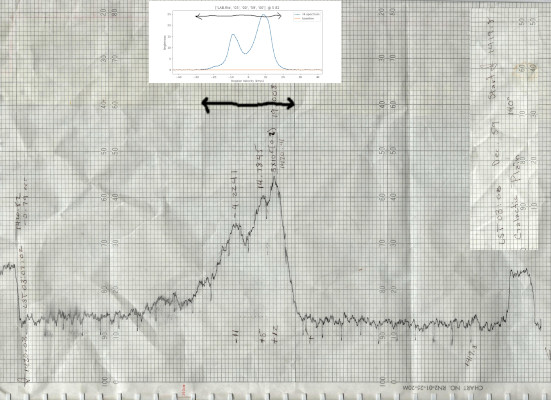

# HI observe

Given an RA-DEC-VEL fits cube, a spectrum will be extracted.

Inspired by the way too complicated
https://teuben.github.io/nemo/man_html/hispectrum.1.html for the GradMap 2018 trip to observe with
the 40ft radio telescope at Greenbank.

## Typical usage:

### Command line mode:

Picking a specific GLON,GLAT

      ./hi-observe.py LAB.fits 45.0 10.0

Picking a pixel is triggered by negative numbers (note this will be at GLON,GLAT = 80,0)

      ./hi-observe.py LAB.fits -200 -180

Picking an RA and DEC (funny greenbank40ft notation where RA = LST)

      ./hi-observe.py LAB.fits 20 58 15   42

### Jupyter notebook mode:

Load the **hi-observe** notebook, set the **fitsfile** and **method** how to set **xpos** and **ypos** and run
the notebook.
      
## Data

The original data described in https://teuben.github.io/nemo/man_html/hi.5.html seem to have been lost.

* "BL" survey : ftp://cdsarc.u-strasbg.fr/pub/cats/VIII/28 (GLON-GLAT slices in FELO)
* BL.fits : handcrafted from the BL survey
* LDS: http://cdsarc.u-strasbg.fr/cgi-bin/Cat?VIII/54 (VELO-GLAT slices in GLON)
* LAB: http://cdsarc.u-strasbg.fr/viz-bin/cat/VIII/76 (has a useful lab.fit GLON-GLAT-VELO cube)
* LAB.fits: see ftp://cdsarc.u-strasbg.fr/pub/cats/VIII/76/lab.fit.gz
* some ancient links:  http://www.sao.ru/cats/~satr/DOC/RADIO-ADC.html

The easiest way to get started is to grab the LAB.fits file, via:

      make LAB.fits

## Possible future improvements:

* Greenbank 40ft mode:  allow extracting at oblique angles in RA-VEL plane
* deal with cubes where VEL is FREQ
* deal with RA-DEC cubes, or where VEL/FREQ is not the 3rd axis.
* add smoothing in Position and/or Velocity

## Resources

The original github repo should be at : https://github.com/teuben/hi-observe
